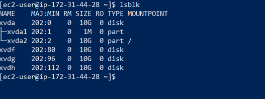
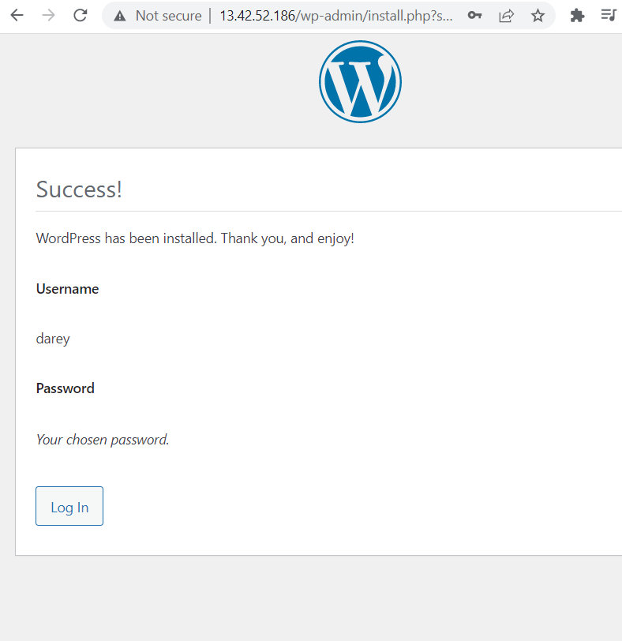

##Web solution with wordpress

Prepare Webserver
#inspect block devices attached to server
`lsblk`

#see mounts and free space
`df -h`

#create partition on each disks
`sudo gdisk /dev/xvdf`
n
8e00
p
w
yes
`sudo gdisk /dev/xvdg`
n
8e00
p
w
yes
`sudo gdisk /dev/xvdh`
n
8e00
p
w
yes

#view the disk partitions
`lsblk`

#install lvm2
`sudo yum install lvm2 -y`

#mark disks as physical volumes and verify
`sudo pvcreate /dev/xvdf1 /dev/xvdg1 /dxvh1`
`sudo pvs`

#add physical volumes to a volume group and verify
`sudo vgcreate webdata-vg /dev/xvdh1 /dev/xvdg1 /dev/xvdf1`
`sudo vgs`

#create logical volumes
`sudo lvcreate -n apps-lv -L 14G webdata-vg`
`sudo lvcreate -n logs-lv -L 14G webdata-vg`
`sudo lvs`

#verify setup
`sudo vgdisplay -v #view complete setup - VG, PV, and LV`
`sudo lsblk` 

#format logical volumes
`sudo mkfs -t ext4 /dev/webdata-vg/apps-lv`
`sudo mkfs -t ext4 /dev/webdata-vg/logs-lv`

#create directories to store website files and store backup of log data
`sudo mkdir -p /var/www/html`
`sudo mkdir -p /home/recovery/logs`

`ls -l /var/www/html`

#mount /var/www/html on apps-lv
`sudo mount /dev/webdata-vg/apps-lv /var/www/html/`

`df -h`
`sudo ls -l /var/log`

#backup files in /var/log into /home/recovery/logs
`sudo rsync -av /var/log/. /home/recovery/logs/`

`sudo ls -l /home/recovery/logs/`

#mount /var/log on logs-lv
`sudo mount /dev/webdata-vg/logs-lv /var/log`

`sudo ls -l var/log`

#restore files back in /var/log
`sudo rsync -av /home/recovery/logs/. /var/log`

`sudo ls -l /var/log`
`df -h`

#update /etc/fstab file
`sudo blkid`
`sudo vi /etc/fstab`
#mounts for wordpress webserver
UUID=5bc7db1e-5910-4713-bad1-44fd0bb54577  /var/www/html ext4 defaults 0 0
 UUID=3a428039-155a-4928-a9f9-beded0bcb8a9 /var/log      ext4 defaults 0 0
 esc
:wqa

#test configuration and reload daemon
`sudo mount -a`
`sudo systemctl daemon-reload`
#verify setup
`df -h`

Prepare database
`sudo gdisk /dev/xvdf`
n
8e00
p
w
yes
`sudo gdisk /dev/xvdg`
n
8e00
p
w
yes
`sudo gdisk /dev/xvdh`
n
8e00
p
w
yes
`sudo yum install lvm2 -y`
`sudo pvcreate /dev/xvdf1 /dev/xvdg1 /dxvh1/`
`sudo vgcreate database-vg /dev/xvdh1 /dev/xvdg1 /dev/xvdf1`
`sudo vgs`
`sudo lvcreate -n db-lv -L 20G database-vg`
`sudo lvs`
`sudo mkdir /db`
`sudo mkfs.ext4 /dev/database-vg/db-lv`
`sudo ls -l /db`
`sudo mount /dev/database-vg/db-lv /db`
`df -h`
`sudo blkid`
`sudo vi /etc/fstab`
#mounts for database
UUID=b7b95626-0c0e-4037-906e-91540045002e /db ext4 defaults 0 0
esc
:wqa
`sudo mount -a`
`sudo systemctl daemon-reload`
`df -h`

Webserver
#update repository, install wget, apache and dependencies
`sudo yum -y update`
`sudo yum -y install wget httpd php php-mysqlnd php-fpm php-json`
`sudo systemctl start httpd`
`sudo systemctl status httpd`
`sudo dnf install https://dl.fedoraproject.org/pub/epel/epel-release-latest-8.noarch.rpm`
`sudo dnf install dnf-utils http://rpms.remirepo.net/enterprise/remi-release-8.rpm -y`
`sudo dnf module list php`
`sudo dnf module reset php`
`sudo dnf module enable php:remi-8.0`
`sudo dnf install php php-opcache php-gd php-curl php-mysqlnd`
`php -v`
`sudo systemctl start php-fpm`
`sudo systemctl enable php-fpm`
`sudo systemctl status php-fpm`
`sudo setsebool -P httd_execmem 1`

#restart apache
`sudo systemctl restart httpd`

#create directory wordpress, downoad and copy to var/www/html
`mkdir wordpress` 
`cd wordpress`
`sudo wget http://wordpress.org/latest.tar.gz`
`ls -l`
`sudo tar xzvf latest.tar.gz`
`ls -l`
`cd wordpress/`
`ls -l`
`sudo cp -R wp-config-sample.php wp-config.php`
`ls -l`
`cat wp-config.php`
`cd ..`
`ls`
`sudo cp -R wordpress /var/www/html/`
`cd /var/www/html/`
`ls`
`sudo rm -rf wordpress/`
`sudo rm -rf lost+found/`
`cd ../..`
`cd`
`ls`
`cd wordpress`
`ls`
`ls -l wordpress`
`sudo cp -R wordpress/. /var/www/html/`
`sudo ls -l /var/www/html`

#change directory and confirm wordpress was copied in
`cd /var/www/html`
`ls`

##Database
#install mysql 
`sudo yum install mysql-server -y`
`sudo systemctl start mysqld`
`sudo systemctl enable mysqld`
`sudo systemctl status mysqld`

#configure to work with wordpress
`sudo mysql_secure_installation`
`sudo mysql -u root -p`
create database wordpress;
show databases;
CREATE USER 'wordpress'@'%' IDENTIFIED WITH mysql_native_password';
GRANT ALL PRIVILEGES ON *.* TO 'wordpress'@'%'WITH GRANT OPTION;
flush privileges;
select user, host from mysql.user;
exit;

web
#open, insert and save
`sudo vi /etc/my.cnf`
[mysqld]
bind-address=0.0.0.0

`sudo mv /etc/httpd/conf.d/welcome.conf /etc/httpd/conf.d/welcome.conf_backup`
`sudo mysql -h 172.31.38.7 -u wordpress -p`
show databases;
exit;

#configure selinux
`sudo chown -R apache:apache /var/www/html`
`ls -l`
`sudo chcon -t httpd_sys_rw_content_t /var/www/html/ -R`
`sudo setsebool -P httpd_can_network_connect=1`
`sudo setsebool -P httpd_can_network_connect_db 1`

#restart to effect changes
`sudo systemctl restart mysqld`
`sudo vi wp-config.php`
`sudo systemctl restart httpd`

